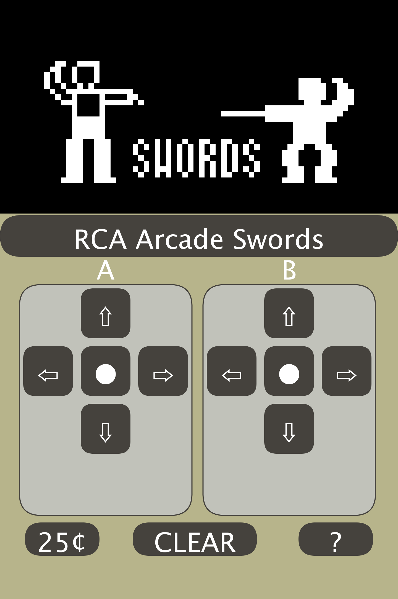

# RCA Studio II and Studio III Home TV Programmer

The system is also known as the RCA Studio 2 and Studio 3 video game console.

## COSMAC Game Emulation

The emulator code in this repository is based on work by Paul Robson, 
who wrote a RCA COSMAC CDP1802 microcomputer and Studio 2 video game console emulator.
Paul Robson's emulation code design
is excellent because it simulates the real-time operaton of the CDP1802 CPU and Studio 2 quite well, when run
on modern computers. 

I ported Paul Robson's well-crafted C code to the Processing language (Java) so that I could use
the Processing graphics library to create a user interface for playing the games.
I also added enhancements to support other COSMAC systems emulation besides the Studio II console.
These include Studio III color and sound, RCA Arcade games (1975), RCA FRED Computer Game System (1974)
and COSMAC VIP board (using CHIP8 and CHIP8X color interpreters).

https://github.com/paulscottrobson/studio2-games 

The following subsections in chronological order describe the evolution of the Studio II.

### SYSTEM 00 Personal Computer

The SYSTEM 00 computer may be the first personal computer built using discrete TTL integrated circuits. 
Joseph Weisbecker designed and constructed the SYSTEM 00 in 1971 (October-December) based on schematic circuit diagram dates in the 
"Microprocessor Manual SYSTEM 00" by Joseph A. Weisbecker. 

The computer architecture of SYSTEM 00 is the starting point for the RCA CDP1802 microprocessor.
The computer instruction set is a subset of what would become the RCA CDP1801 and CDP1802 microprocessor instruction set.

SYSTEM 00 used an oscilloscope for a video display and supported a resolution of 32 x 32 pixels (display memory is 128 bytes).
There is also a 64 x 16 resolution for display 4 lines with a max of 10 characters per line usig a 5x7 dot martrix character representation.

The SYSTEM 00 document contains two sample programs, 1) Deduce game and 2) Display (on OScilloscope).

http://www.retrotechnology.com/memship/cosmac_system_00.html

http://www.cosmacelf.com/gallery/system-00.html

### FRED Computer

FRED is an acronym for "Flexible Recreational Educational Device". 

This document describes the FRED computer (July 1972):

http://www.retrotechnology.com/memship/Sarnoff_FRED_manual_Weisbecker_Robbi.pdf

### FRED II Computer

Based on schematics of the FRED II, it was built around July, 1974 (Hagley Library source). 
Information about the FRED II is available at:

http://www.retrotechnology.com/memship/cosmac_fred2.html

### RCA COSMAC Computer Game System

The RCA COSMAC Computer Game System is based on the FRED II computer. It read tapes to load game programs. 
The Hagley Library Acc. 2464, Box 919, FRED folder 4, has a document written by 
Joe Weisbecker in January 1975 titled "Instructions for the RCA COSMAC Computer Game System".
I conclude that the games described in the document were written in the late 1974.

One documented game is Bowl/Tag and it runs as a simulated coin arcade game in the RCA COSMAC Computer Game System. 
Using the WAV file AUD_2464_09_B41_ID01_01 Tag-Bowling.wav purchased from the Hagley Library (see below), I was able to extract
the ROM image and stored it as an arc file type. This game runs in the emulator.

The procedure and program tool I used to extract the program byte code from a WAV file is available on GitHub at

https://github.com/ajavamind/Extract-WAV-Data

A distinguishing characteristic of games that run in FRED II systems is that the first byte of programs is "0", the IDLE instruction that 
waits for a DMA or interrupt. 

### RCA Video Coin Arcade Game Console

The RCA Video Coin Arcade console games preceded the Studio 2 and were built around June 1975 based on dated circuit schematics from the Hagley Library. 
A RCA internal correspondence document, "COSMAC Coin Machine - Status Report" dated 26 December, 1974 from Joe Weisbecker and
Phillip Baltzer describes staged plans for a Video Coin Arcade machine (Hagley Library Acc 2464, Box 919, Folder 4). 
The Hagley library also photos of the Arcade game consoles.

The consoles were placed in a shopping mall to evaluate the marketability of the game systems.
Based on information from the Hagley Museum and Library, Wilmington, Delaware,
I was able to emulate the circuit board for these games. 
The console game board used the 1801 (two integrated circuits) as the microprocessor.
The RCA Arcade consoles had a screen resolution of 32x64 pixels that was the same as the Studio 2.

This video is a screen capture of the RCA Video Arcade Game "Swords" emulation running on a Windows 10 notebook computer. 
The game was written by Joseph Weisbecker in 1975. 

https://youtu.be/xbSNnIyc1K4

The "Swords" game was stored on an analog cassette tape and was digitized into a WAV file provided by the Hagley Museum and Library.  
I wrote a program in Processing to extract the game code instruction bytes encoded in the WAV file audio to use with the Arcade game emulator. See https://github.com/ajavamind/Extract-WAV-Data

-Hagley Museum and Library: Sarnoff/RCA Collection
-Joseph A. Weisbecker's archived manuscripts and materials
-Accession 2464 
-Box Number AVD B41
-Cassette Tape AUD_2464_09_B41_ID01_02 Swords.wav
-The source of WAV files purchased from the Hagley Library and other related materials is from Atariage member "ubersaurus".

### COSMAC ELF

Joe Weisbecker's articles on the COSMAC ELF computer appeared in Popular Electronics, starting August, 1976.

http://www.exemark.com/Microcontrollers/PopularElecwebc.pdf

### Studio II Console

The Studio II game console was sold by RCA beginning with its announcement in January 1977. The project was canceled in December 1977.

### Studio III Console

The Studio III game console was never manufactured by RCA, but was sold by manufacturers outside the USA. RCA game programmers wrote Studio III games using the COSMAC VIP boards for software development and prototyping in 1977.
An add-on graphics card supplied the color support and a programmable sound card was used for Studio III enhanced sound.

My Studio 3 emulation supports color graphics and programmable sound for Studio III games that use color and programmable sound generation. I was able to add color and sound emulation because I found an archived **Programming Manual for Studio III**, written in September 1977, detailing the color and sound functions. I made some contributions to that document when it was written. 

Studio III Pinball Game Screenshot

### Studio IV Console

The Studio IV game console was in the planning stages, in 1977, but was never built. 
There is a Studio IV interpreter cassette tape from Joe Weisbecker in the Sarnoff Collection at the College of New Jersey.

http://embark.tcnj.edu/OBJ2416?sid=63&x=661

### COSMAC VIP Computer

The COSMAC VIP (Video Interface Processor) CDP18S711 is a single board computer for home hobby use to learn about computers and programming.
Joe Weisbecker designed the system and wrote a CHIP8 interpreter a simpler streamlined version of the Studio II/III interpreter.
Later he expanded the interpreter, naming it CHIP8X to handle adapter cards (sound, color video, etc.) for the VIP board.

Since the emulator implements the RCA CDP1802 microcomputer instruction set directly, it will run all the interpreters written for Studio II/III or VIP boards.
The VIP has many major design similarities to the Studio III.

## Running the Emulator

You will need to download the Processing SDK to run the emulated games. Please donate to the Processing Foundation. 

> Processing is a flexible software sketchbook and a language for learning how to code within the context of the visual arts. Since 2001, Processing has promoted software literacy within the visual arts and visual literacy within technology. There are tens of thousands of students, artists, designers, researchers, and hobbyists who use Processing for learning and prototyping.

https://processing.org/

I chose Processing/Java so that the code can be ported or generated for Windows, Apple iOS, Linux, Android, and Web JavaScript.
I used the Beads sound library for sound generation with the Processing SDK.
In the Processing SDK menu add this library: Sketch -> Import Library -> Beads  (a library for real-time sound for Processing)

Screenshot Android app generated from Processing running on a Samsung S8 phone. Sound for Android ues a different library.

Windows 10 Screenshot

## Using the Emulator

You can change the game run by clicking on the cartridge name under the screen area. 
Clicking on the right side of the cartridge selects the next game, and on the left side selects the previous game in a list of games.
Then click the "Clear" button to reset and run the game.

As currently implemented the emulator uses the number keys 0-9 for the A keypad on the Studio II console, and the numeric keys (num lock) for keys 0-9 on the B keypad.

For debug the following keys may be used (upper or lower case):
- 'R' key performs a system reset
- 'S' key saves a screen shot in the folder "screenshot"
- 'F' shows the frame rate in the Processing SDK console terminal output area
- 'D' outputs debug information in the Processing SDK console terminal output area
- 'C' Arcade Game toggles coin insertion flip-flop emulation
- 'P' Arcade Game toggles circuit board parameter switch emulation

The "gameSelected" variable is an array index used to select the game to run. It is set by default to the Studio 3 ROM.

## Emulator Performance

I have run the emulator on Windows 10 with an Intel i7 processor and AMD Radeon 560 graphics card 
and was able to achieve a frame rate of 120 frames per second without any problems. On Samsung S8 smart phone using Android, 
again no issues. However, when running the Android app on a Samsung Chromebook Plus, the processor could not keep up and 
showed a significant delay.

## Games

Game ROM cartridges and home-made games included here are from Paul Robson's Github site (above) and the Emma 02 game console emulation sites:

http://www.emma02.hobby-site.com/studio.html

https://github.com/etxmato/emma_02

Many thanks to Marcel van Tongeren for his contributions on the Emma 02 site.

I thought the Studio III resident game ROM, with the color Blackjack game that I wrote, was lost, but I discovered it was preserved at the EMMA 02 site under the [Victory MPT-02](http://www.emma02.hobby-site.com/victory.html) videogame console made by Soundic.

The emulator reads the following game file types:
1. ".st2" Studio II cartridge format, loads at specific ROM address locations defined in the file
2. ".bin" Binary program file for Studio II game, loads at address 0x0400, the plug-in cartridge starting location
3. ".rom" Binary program file for Studio II/III base ROM, loads at address 0x0000
4. ".ch8" Binary program file for COSMAC VIP board RAM, loads at address 0x0200. Assumes VIP ROM at 0x8000
5. ".c8x" Binary program file for COSMAC VIP board RAM, loads at address 0x0300. Assumes VIP ROM at 0x8000, Color RAM at 0xC000
6. ".vip" Binary program file for COSMAC VIP board RAM, loads at address 0x0000. Assumes VIP ROM at 0x8000
7. ".arc" Binary program file for RCA Video Arcade game board RAM, loads at address 0x0000. 
8. ".fd2" Binary program file for RCA FRED 2 computer RAM, loads at address 0x0000. 

## Studio II/III Game Console Design

Looking back at the games, it is amazing to me how much game function was squeezed into a small 1024 byte ROM cartridge.
 
Resident game ROMs (2048 bytes) for Studio II included a game instruction pseudo code interpreter (starting at memory location 0) and resident games (starting at 
memory location 0x0400).

Resident game ROMs (3072 bytes) for Studio III included a game instruction pseudo code interpreter (starting at location 0) and resident games Doodle, Pattern, Bowling 
(starting at 0x0400), and Blackjack (starting at location 0x0C00). 

The only difference between the Studio II and Studio III interpreters is that the Studio III interpreter replaced a 3 byte branch instruction with 1 byte NOP instruction in the interrupt service routine to make room for a code change that checks the EF1 line.
This 3 machine cycle instruction is still needed for correct video display timing (29 machine cycles before the first DMA out of the video display memory). 
Note that in the Studio III programming manual, there is a caution note to not use any 3 machine cycle instructions (NOP, Long Branch)
in a program's 1802 machine language subroutines embedded in the game interpretive code. 

Color and sound features used in games were programmed in the game cartridge.

There was an engineering cost trade-off that favored limits to ROM size and hardware complexity versis faster game speed, screen display size, and color/sound features.
By using interpreter psuedo code to write games instead of coding directly with 1802 CPU instructions, small game ROM size was made possible, with shared functions in
the interpreter. 

The hardware design was elegant and relatively simple.

Games were slow for three reasons: 
1. No game instruction execution occurs during screen display update frame cycles. The screen display update uses 49% of the CDP1802 processor time. The remainder, 51% of the total processor time, can be used for game play at a rate of 60 frames per second. This means that a game writer only has 0.85% of the processor time to generate one frame of game play! Because the display is low resolution, 64 wide x 32 high pixels, there was sufficient time to update the display without excessive flicker.
2. Decoding interpreter pseudo code.
3. Drawing graphics with software instructions without hardware assistance (for example, no hardware sprite graphics).

Due to its operating speed, low resolution, and keyboard input, in my opinion, the Studio II system was better suited for puzzles and card games, rather than action games. 

## RCA Game Development

| RCA COSMAC Computer System Game | Author | Notes |
| --------- | ------ | ----- |
| Jackpot Game | Joyce Weisbecker | Daughter of Joseph Weisbecker, Code lost |
| Space War Game | C.T. Wu | Code lost |
| Match Game | A. Marcantonio | Code lost |
| Acey-Deucy| Joseph Weisbecker | Code lost |
| Spot Speedway | Anthony Robbi  | Code lost |
| Deduce | Joseph Weisbecker | Code lost |
| Life | M. Blecker | Code lost |
| Bowl/Tag | Joseph Weisbecker | Extracted from cassette tape, emulation based on FRED II |

| RCA Coin Arcade Game Console | Author | Notes |
| --------- | ------ | ----- |
| Swords | Joseph Weisbecker | Extracted from cassette tape, emulation based on FRED II  |
| Mines |  | cassette tape?, FRED II |
| Chase II |  | cassette tape?, Similar to Tag, FRED II |
| Bowling | Joseph Weisbecker | cassette tape?, FRED II |

| Studio II Monochrome Game | Author | Notes |
| --------- | ------ | ----- |
| Doodle/Patterns/Bowling/Freeway/Addition | Joseph Weisbecker | Studio II Resident Games |
| Space War | Jeff Winsor | |
| Fun With Numbers | Philip Baltzer |   |
| School House | Joyce Weisbecker | Daughter of Joseph Weisbecker |
| Speedway/Tag | Joyce Weisbecker | Note 1 |
| Tennis/Squash | Andrew Modla | 512 bytes, This is the second Studio II game I wrote |
| Baseball | Andrew Modla |  Third Studio II game I wrote|
| Blackjack | Andrew Modla | Note 2 |
| Gunfighter/Moonship Battle | Andrew Modla  | This is the first Studio II game I wrote |
| Studio II Point-of-Purchase Demo | Andrew Modla  | 1024 bytes |
| Studio II Test Cartridge | Jack Wright  | 1024 bytes |

| Studio III Color Game | Author | Notes |
| --------- | ------ | ----- |
| Doodle/Patterns/Bowling/Blackjack | Joseph Weisbecker, Andrew Modla (Blackjack) | 2048 bytes, Studio III Resident Games Note 3 |
| MathFun/Quiz | Andrew Modla | 1024 bytes, Note 4 |
| Biorhythm | Gooitzen van der Wal | Not a game, this is a Biorhythm calculator |
| Pinball | Andrew Modla | 1024 bytes, Note 5 |
| Bingo | Andrew Modla | Not a game, 512 bytes, this is a Bingo number caller and verification helper Note 6 |
| Concentration/Match | Gooitzen van der Wal |  |
| Star Wars | Gooitzen van der Wal |  |
| TV Typewriter/Ticker Tape | Andrew Modla | 1024 bytes, originally for Studio III, CHIP8 version exists |
| Studio III Point-of-Purchase Demo | Andrew Modla | 1024 bytes, code lost |

| Other Studio II Games | Author | Notes |
| --------- | ------ | ----- |
| Computer | ? | Not a game |
| Hockey | Paul Robson | |
| Combat | Paul Robson | |
| Scramble | Paul Robson | |
| Rocket | Lee Romanow | original by Joseph Weisbecker for ELF, converted by Romanow
| Outbreak | Lee Romanow | |
| Pacman | Paul Robson | |
| Kaboom | Paul Robson | |
| Asteroids | Paul Robson | |
| Berzerk | Paul Robson | |
| Invaders | Paul Robson | |
| Tv Arcade 2012 | Lee Romanow | |

| Studio IV Color Game | Author | Notes |
| --------- | ------ | ----- |
| Match Game | Andrew Modla | Planned enhanced version, not implemented |
| Helicopter Gunship | Andrew Modla | Planned, not implemented |

| COSMAC VIP Games | Author | Notes |
| --------- | ------ | ----- |
| Sword Fighter | Joseph Weisbecker | VIP game  Ref 1 (not CHIP8) The original game was RCA Coin arcade game |
| Bowling | Gooitzen van der Wal | original by Joseph Weisbecker, converted to CHIP8 by van der Wal |

Additional Notes:
1. Joyce Weisbecker http://www.vintagecomputing.com/index.php/archives/2018/historys-first-female-video-game-designer
2. Blackjack is the 4th Studio II game I wrote. As a Studio II game cartridge this version of Blackjack used single digit bet amounts.
3. The Blackjack game conversion to Studio III resident game added color and two digit bet amounts.
There is also a VIP CHIP8 version of Blackjack in color.
4. I was not sure I did MathFun until I discovered an old memo page (from 1977) in my resume folder. It lists all the games I wrote for Studio II and III. I forgot I did this one, confusing it with Fun With Numbers, that Phil Baltzer did.
5. Pinball is the 5th Studio game I wrote in Spring 1977. This may be the first software game program that simulated pinball game machine operations.
There is also a VIP CHIP8 version of Pinball.
6. There is also a COSMAC VIP CHIP8 version of Bingo.

## Documents and References

1. Game Instruction Manual for Studio II and Studio II, 1977, RCA Corporation, David Sarnoff Research Center, Princeton, NJ (Andrew Modla collection) This is my personal copy. Stereo 3D photos (L/R side by side) of this document are in the Photos folder. Joe Weisbecker's copy is at the Hagley Museum and Library, 298 Buck Road, Wilmington, DE 19807, USA.
2. Internal Memo RE: Studio II & III PROGRAMS, 12/15/1977, Andrew Modla, David Sarnoff Research Center, Princeton, NJ (Andrew Modla collection)
3. Programming Manual for Studio III, September 1977, RCA Corporation, David Sarnoff Research Center, Princeton, NJ (source: 
http://bitsavers.org/components/rca/cosmac/ (Programming_Manual_for_STUDIO_III_Sep77.pdf)
4. MPM-201A_User_Manual_for_the_CDP1802_COSMAC_Microprocessor_1976.pdf From http://bitsavers.org/components/rca/cosmac/ 
(MPM-201A_User_Manual_for_the_CDP1802_COSMAC_Microprocessor_1976.pdf)
5. MPM-201B_CDP1802_Users_Manual_Nov77 http://bitsavers.org/pdf/rca/1802/  (MPM-201B_CDP1802_Users_Manual_Nov77.pdf)
6. VP-710_RCA_COSMAC_VIP_Game_Manual_Dec78.pdf From http://bitsavers.org/components/rca/cosmac/
(VP-710_RCA_COSMAC_VIP_Game_Manual_Dec78.pdf)
7. RCA COSMAC Game Manual II (VP-720), 8-1980, RCA Microcomputer Products, New Holland Avenue, Lancaster, PA 17604. (Andrew Modla collection)

Video display chip CDP1861 documentation can be found here along with other hardware data specification sheets:
http://www.cosmacelf.com/publications/data-sheets/  cdp1861.pdf

Studio II manuals can be found at:
http://bitsavers.org/components/rca/cosmac/studio_II/

Descriptions and sources of information about RCA COSMAC technology can be found at:

http://www.retrotechnology.com (Herb Johnson)

Hagley Museum and Library, Wilmington, DE 19807, USA https://www.hagley.org/research

The College of New Jersey, Sarnoff Collection, Trenton, NJ, USA
https://davidsarnoff.tcnj.edu/

## Credits
Many thanks to Studio 2 enthusiasts, game programmers and historians, who helped preserve and archive documentation and code, and who wrote 1802/Studio2 emulators. Your dedicated work and enthusiasm are very appreciated.
This respository contains a complete list of games originally developed by RCA for the Studio II and III.

Special dedication to Joe Weisbecker who started it all. One of his goals for the COSMAC and Studio II was computer and programming education. 

## Usage
This respository is intended for educational and historical research. Program emulation shows how the games looked and functioned during play. 

## Postscript
My intent for this repository is a tribute to Joe Weisbecker's work on personal and educational computers and continue to extend with the goal of education.

Writing this is like creating a programmer's memoir. I am fortunate to be able to reconstruct the environment to run code written in the past without the hardware it ran on. 
Many programmer's work is lost over time with a project's termination or expiration, as the technology advances, so being able to
see and preserve what was done in the distant past is heartening and personally rewarding.

Written by Andrew Modla, RCA Studio II/III game developer, 1976-1977, RCA COSMAC VIP game and home hobby computer software developer, 1977-1980.
