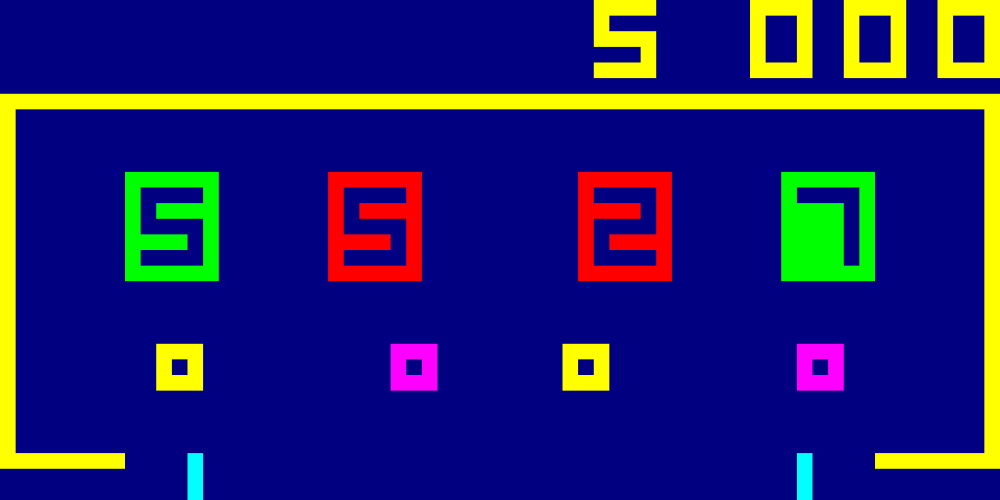
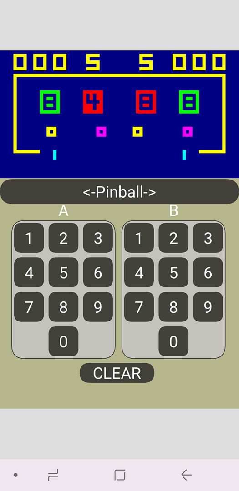

# RCA Studio II and Studio III Home TV Programmer

The system is also known as the RCA Studio 2 and Studio 3 video game console.

## Studio II Emulator

The emulator code in this repository is based on work by Paul Robson, 
who wrote a RCA COSMAC CDP1802 microcomputer and Studio 2 video game console emulator.
Paul Robson's emulation code design
is excellent because it simulates the real-time operaton of the CDP1802 CPU and Studio 2 quite well, when run
on modern computers. 

https://github.com/paulscottrobson/studio2-games 

## Studio III Emulator

The Studio III game console was never built by RCA, but I and others wrote games using Studio III prototype boards in 1977.
My Studio 3 emulation will support color graphics and sound for Studio III games that use color and programmable sound generation. 

Studio III Pinball Game Screenshot

I ported Paul Robson's well-crafted C code to the Processing language (Java) and included
emulation for the Studio III game console color graphics and programmable sound. I was able to add color and sound emulation because I found an archived **Programming Manual for Studio III**, written in September 1977, detailing the color and sound functions. I made some contributions to that document when it was written. 

## Running the Emulator

You will need to download the Processing SDK to run the emulated games. Please donate to the Processing Foundation.

https://processing.org/

I chose Processing/Java so that the code can be ported or generated for Windows, Apple iOS, Linux, Android, and Web JavaScript.
I used the Beads sound library for sound generation with the Processing SDK.
In the Processing SDK menu add this library: Sketch -> Import Library -> Beads  (a library for real-time sound for Processing)

Screenshot Android app generated from Processing running on a Samsung S8 phone. Sound for Android ues a different library.

Windows 10 Screenshot

## Using the Emulator

As currently implemented the emulator uses the number keys 0-9 for the A keypad on the Studio II console, and the numeric keys (num lock) for keys 0-9 on the B keypad.

For debug the following keys may be used:
- 'R' key performs a system reset
- 'S' key saves a screen shot in the folder "screenshot"
- 'F' show the frame rate in the Processing SDK console terminal output area

You will need to set the "gameSelected" variable array index to change the game run. It is set to the Studio 3 ROM.

## Emulator Performance

I have run the emulator on Windows 10 with an Intel i7 processor and AMD Radeon 560 graphics card 
and was able to achieve a frame rate of 120 frames per second without any problems. On Samsung S8 smart phone using Android, 
again no issues. However, when running the Android app on a Samsung Chromebook Plus, the processor could not keep up and 
showed a significant delay.

## Games
Game ROM cartridges and home-made games included here are from Paul Robson's Github site (above) and the Emma 02 game console emulation sites:

http://www.emma02.hobby-site.com/studio.html

https://github.com/etxmato/emma_02

Many thanks to Marcel van Tongeren for his contributions on the Emma 02 site.

I thought the Studio III resident game ROM, with the color Blackjack game that I wrote, was lost, but I discovered it was preserved at the EMMA 02 site under the [Victory MPT-02](http://www.emma02.hobby-site.com/victory.html) videogame console made by Soundic.

The emulator can read the following game file types:
1. ".st2" Studio II cartridge format, loads at specific ROM address locations defined in the file
2. ".bin" Binary file for Studio II game, loads at 0x0400, the plug-in cartridge starting location
3. ".rom" Binary file for Studio II/III base ROM, loads at 0x0000
4. ".ch8" Binary file for COSMAC VIP board RAM, loads at 0x0200

## Game Console Design
Looking back at the games, it is amazing to me how much game function was squeezed into a small 1024 byte ROM cartridge.
 
Resident game ROMs (2048 bytes) for Studio II included a game instruction pseudo code interpreter (starting at memory location 0) and resident games (starting at 
memory location 0x0400).

Resident game ROMs (3072 bytes) for Studio III included a game instruction pseudo code interpreter (starting at location 0) and resident games Doodle, Pattern, Bowling 
(starting at 0x0400), and Blackjack (starting at location 0x0C00). 

The only difference between the Studio II and Studio III interpreters is that the Studio III interpreter replaced a 3 byte branch instruction with 2 byte instructions.
This was needed for correct video display timing. Note that in the Studio III programming manual, there is a caution note to avoid 3 byte instructions in 1802 machine 
language subroutines. Color and sound features used in games were programmed in the game cartridge.

There was an engineering cost trade-off that favored limits to ROM size and hardware complexity versis faster game speed, screen display size, and color/sound features.
By using interpreter psuedo code to write games instead of coding directly with 1802 CPU instructions, small game ROM size was made possible, with shared functions in
the interpreter. 

The hardware design was elegant and relatively simple.

Games were slow for three reasons: 
1. Interpreter pseudo code overhead
2. Drawing graphics with software instructions without hardware assistance (for example, no hardware sprite graphics)
3. No game instruction execution during screen update cycles. 

Due to its operating speed and keyboard input, the Studio II system was better suited for puzzles and card games, rather than action games. 

## Game Developers
| Studio II Monochrome Game | Author | Notes |
| --------- | ------ | ----- |
| Doodle/Patterns/Bowling/Freeway/Addition | Joseph Weisbecker | Studio II Resident Games |
| Space War | Jeff Winsor | |
| Fun With Numbers | Philip Baltzer |   |
| School House | Joyce Weisbecker | Daughter of Joseph Weisbecker |
| Speedway/Tag | Joyce Weisbecker | |
| Tennis/Squash | Andrew Modla | |
| Baseball | Andrew Modla | |
| Blackjack | Andrew Modla | |
| Gunfighter/Moonship Battle | Andrew Modla  | |

| Studio III Color Game | Author | Notes |
| --------- | ------ | ----- |
| Doodle/Patterns/Bowling/Blackjack | Joseph Weisbecker, Andrew Modla (Blackjack) | Studio III Resident Games: improved Blackjack |
| MathFun/Quiz | Philip Baltzer? |  |
| Biorhythm | Gooitzen van der Wal | Not a game, this is a Biorhythm calculator |
| Pinball | Andrew Modla |  |
| Bingo | Andrew Modla | Not a game, this is a Bingo number caller and verification aid |
| Concentration/Match | Gooitzen van der Wal |  |
| Star Wars | Gooitzen van der Wal |  |

| Other Studio II Games | Author | Notes |
| --------- | ------ | ----- |
| Computer | ? | Not a game |
| Hockey | Paul Robson | |
| Combat | Paul Robson | |
| Scramble | Paul Robson | |
| Rocket | Lee Romanow | original by Joseph Weisbecker, converted by Romanow
| Outbreak | Lee Romanow | |
| Pacman | Paul Robson | |
| Kaboom | Paul Robson | |
| Asteroids | Paul Robson | |
| Berzerk | Paul Robson | |
| Invaders | Paul Robson | |
| Tv Arcade 2012 | Lee Romanow | |

## Credits
Many thanks to Studio 2 enthusiasts, game programmers and historians, who helped preserve and archive documentation and code, and who wrote 1802/Studio2 emulators. Your dedicated work and enthusiasm are very appreciated.
This respository contains a complete list of games originally developed by RCA for the Studio II and III.

Special dedication to Joe Weisbecker who started it all. One of his goals for the Studio II was computer and programming education. 
My intent here is to continue to extend this goal.

## Use
This respository is intended for educational and historical research. Studio II emulation shows how the games looked and functioned during play. 

Written by Andrew Modla, RCA Studio II/III game developer, 1976-1977.
